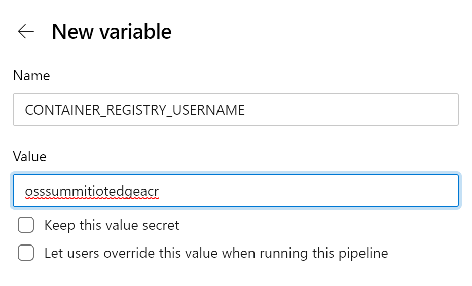
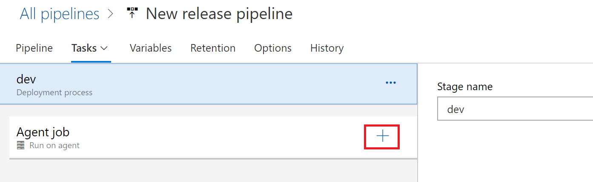
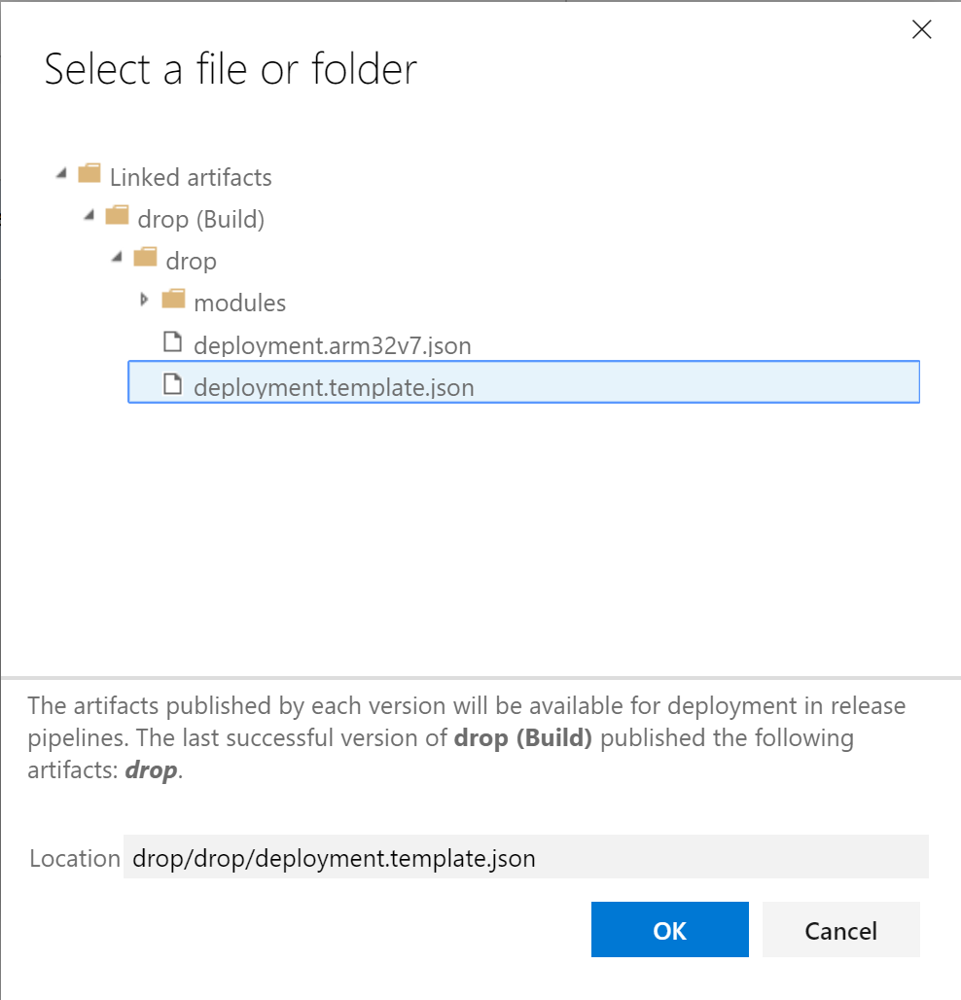

# OSS Summit IoT Edge Lab

You can easily adopt DevOps with your **Azure IoT Edge** applications with the built-in **Azure IoT Edge** tasks in **Azure Pipelines**. This lab demonstrates how you can use the **continuous integration** and **continuous deployment** features of **Azure Pipelines** to build, test, and deploy applications quickly and efficiently to your **Azure IoT Edge**.

In this lab we will also create an **Azure IoT Hub** and **Azure Container Registry**.

Pre-requisite

## Azure Resource Group

Create an **Azure Resource group** in the **Azure Portal** using your **subscription**.

Provide a name for the **resource group**.  

Choose the **region** for thes **Resource Group**.   **West Europe** is a good choice.

## Azure IoT Hub

Learn more about Azure IoT Hubs here:  [Azure IoT Hubs](https://azure.microsoft.com/en-us/services/iot-hub/)

Create a new **Azure IoT Hub**.

Choose your current active **Azure** subscription.

The *Resource Group* will be the previously created **Resource Group**.

Choose the same *Region* as the **Resource Group**.

Provide a *Name* for the **IoT Hub**

Let's **manually** create a new IoT Device connected to the Hub.    **DPS** can also be used for automatic **device provsioning**.

Provide a *Device ID* for the IoT Device.   This **ID** will be used to uniquely identify the device connected to the hub. 

For this lab we will use a **"Symmetric key"** for *Authentication*.

*Auto-Generate* the keys.

The **IoT Edge** device is now added to the **IoT Hub**.

## Azure Container Registry

Learn more about Container Registries here:  [Azure Container Registries](https://azure.microsoft.com/en-us/services/container-registry/)

Create a new **Azure Container Registry**.

Provide a *Registry Name* for the **Azure Container Registry**

Choose your current active **Azure** subscription.

The *Resource Group* will be the previously created **Resource Group**.

Choose the same *Region* as the **Resource Group**.

Enable *Admin User*

*SKU* is **Standard**

Take note of all the *Access Keys*  This will be need when setting up both the *Build* and *Release* pipelines. 

## Configure the Edge Device

->  Url to Setting up IoT Edge Device

## Azure Devops Pipelines

Import the **IoT Edge** solution from the pre built repository.   This Edge application consists of a few modules:  *simulated temperature sensor*.  

The lab will be focused on deploying the **IoT Edge** solution to a Raspberry Pi and hence the build proceses with all be Armv7 packages.

Let begin by **importing** the solution.

Fill in the git hub url [GitHub Repo](https://github.com/iotedgelabsza/iotedgelab)  "https://github.com/iotedgelabsza/iotedgelab"   This repository contains the source code we will be using in this lab.   The import will copy the source code from **GitHub** into your own **Azure Devops** Repository.

Once the source is imported, we will start by creating a **Build Pipeline**.

Our code is in the **Azure DevOps** repository whoch we previously imported.   Choose **Azure Repos**

Select the repository **"iotedgelabssosssummit"** 

We will bot be using existing Azure Pipeline YAML files, so choose the **"Starter Pipeline"**.   The **"Starter Pipeline** is a **minimal** YAML configuration. This will be used as a starting point for this lab.

A minimal set of YAML is displayed.

Test the **"Starter Pipeline"** to see if everything is functioning like it should.

Provide a **commit** message and then **Save and Run**

An **agent** will start the **Build** job.

The **Build** will run to completion.

Remove the **Sample** scripts and tasks created (as per image).  Ensure your cursor is in the correct position in the **YAML** as the new task will be inserted at the cursor position.  Create a **New** Azure IoT Edge **Task**.

The first Azure IoT **Task** to add is a **Task** to build the **Azure IoT Edge Images**.

Select the **Action** of *"Build Module Images"*

The template json file in our solution is "deployment.template.json".

This **Build Pipeline** is intended for a **Raspberry Pi**, so we will choose "Arm32v7" as the **Default Platform**.

Before the **Task** that we just created will work, we need to add 3 *variables*.   These *variables* are used in the solution's, **.env** file to enable the image to Build and Upload to ACR (Azure Container Registry).

These **variables** are:

  *CONTAINER_REGISTRY_ADDRESS* - The endpoint of the Azure Container Registry

*CONTAINER_REGISTRY_USERNAME* - The user name to access the registry.

*CONTAINER_REGISTRY_PASSWORD* - The password need to access the registry.

These variables we noted down when we created the ACR, so will need them now to create the variables.

Click the **"New Variable"** button

The **Name** of the new variable is *CONTAINER_REGISTRY_ADDRESS*.   The **Value** is the endpoint of the container registry previously created.

The **Name** of the new variable is *CONTAINER_REGISTRY_USERNAME*.   The **Value** is the user name of the container registry previously created.

The **Name** of the new variable is *CONTAINER_REGISTRY_PASSWORD*.   The **Value** is the password of the container registry previously created.

All *3 Variables* are now created and will be used when the **Azure IoT Edge image** is **Built**.

Let's test the pipeline to see if our **Azure IoT Edge** module images **Build**.

The **Images** now **Build** successfully.

We will now **Edit** the Pipeline to add more tasks.

Add another **Azure IoT** task.  Again make sure the cursor postion YAML is at the correct position (after the previous **Build** task).  

The next Azure IoT **Task** to add is a **Task** to push the built images to **ACR**.

Select the **Action** of *"Push Module Images"*

Choose the **Container Registry Type** as *Azure Container Registry*.

Third party container registries can also be used.

Select a valid **Azure Subscription**

**Authorize** access to the ACR in thee **Subscription**

The template json file in our solution is "deployment.template.json".

This **Build Pipeline** is intended for a **Raspberry Pi**, so we will choose "Arm32v7" as the **Default Platform**.

Add **Registry Credential** to the deploy manifest.

If the **Build** Pipeline is executed there may be an Authorization failure.   **Re-Authorise**.

Add a **"Publish build artifacts"** task.  In *Path to publish*, put the variable $(Build.ArtifactStagingDirectory)

The *Artifact Name* will be **drop**

Set the *Artifact publish location* to **Azure Pipelines** 

We have completed the **Build** Process.   The output of the build is stored as artifacts.  These artifacts can then be deployed to various environments.   We will now be creating a "Dev" release pipeline.

Create a new **"Release"**  pipeline.

Create an **"Empty Job"**

For this release pipeline, the *Staging name* will be **"dev".**

We will now add the previously created Artifacts to the release pipeline.

Click the **+ Add** to add the artifacts

Select *Build* Artifact.   Just the current project.  

Select the previous **Build** Pipeline.

The version we want to build is the **latest**.

The *Source Alias* is drop as that is the name we used for our Artifacts previously.

Finally click the **Add** button.

This **Release** pipeline is to be triggered on the **Build**.   Click on the **Trigger** button. 

*"Enable"* the **Trigger**

Lets add some tasks for this release.   

An **Agent** is preconfigured to be used.    Add a **Task** to the Agent by clicking on the **"+"**

We will create another **"Azure IoT Edge Task"**.

Next part of the process is to create an Azure IoT Edge **Deployment Manifest**.   IoT Edge uses this manifest to know what modules will be deployed to devices as part of a solution.

Choose **Generate Deployment Manifest** as an *Action*.

The *Template json file" to be used is the **$(System.DefaultWorkingDirectory)/drop/drop/deployment.template.json**   This was created in the **Build** process and is part of the created Artifacts.

This **Build Pipeline** is intended for a **Raspberry Pi**, so we will choose "Arm32v7" as the **Default Platform**.

The *Output Path* for the manifest is **$(System.DefaultWorkingDirectory)/drop/drop/configs/deployment.json**

We now need to create the 3 ACR variables for the **Release** pipleline.  

These **variables** are:

  *CONTAINER_REGISTRY_ADDRESS* - The endpoint of the Azure Container Registry

*CONTAINER_REGISTRY_USERNAME* - The user name to access the registry.

*CONTAINER_REGISTRY_PASSWORD* - The password need to access the registry.

Select the **Variables** tab.

Add each variable as we did previously in the **Build** process.

We will now add our final **Release** Task.

Add another **Azure IoT Edge** task.

Next part of the process is to continuously deploy to an Edge device 

Choose **Deploy to IoT Edge Devices** as an *Action*.

Select the Azure Subscription that contains your **IoT Hub**

Select your **IoT hub** under *IoT Hub Name*.

Choose **single/multiple device**: Choose whether you want the **release** pipeline to deploy to **one device** or **multiple devices**.
If you deploy to a **single device**, enter the *IoT Edge device ID*.

If you are deploying to **multiple** devices, specify the device **target condition**. The **target condition** is a filter to match a set of **IoT Edge** devices in IoT Hub. If you want to use **Device Tags** as the condition, you need to update your corresponding devices Tags with IoT Hub device twin. Update the **IoT Edge deployment ID** and **IoT Edge** deployment priority in the advanced settings.

Under *Advanced \ IoT Edge deployment ID* set the variable: **$(System.TeamProject)-$(Release.EnvironmentName)**

**Save** your changes

Trigger a Build to Verify if everything is complete.

